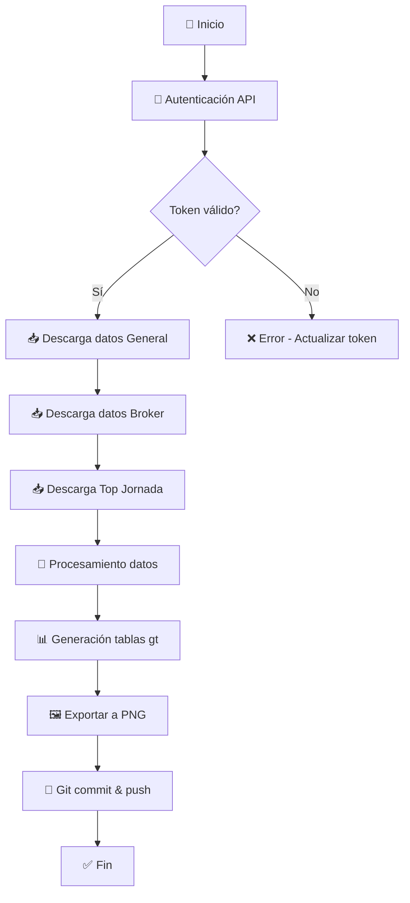

<div align="center">

# 🏀 SuperManager Broker General


**Bot automatizado en R para extracción, procesamiento y visualización de datos del SuperManager ACB**

[](https://www.r-project.org/)
[](LICENSE)
[]()
[](https://github.com/features/actions)

<br/>

<a href="https://www.acb.com"></a>
&nbsp;&nbsp;&nbsp;&nbsp;
<a href="https://supermanager.acb.com"></a>

*Datos oficiales de [ACB.com](https://www.acb.com) • Juego [SuperManager ACB](https://supermanager.acb.com)*

</div>

---

## 📋 Tabla de Contenidos

- [🎯 Descripción](#-descripción)
- [✨ Características](#-características)
- [📊 Rankings Generados](#-rankings-generados)
- [🗂️ Estructura del Proyecto](#️-estructura-del-proyecto)
- [⚙️ Flujo de Trabajo](#️-flujo-de-trabajo)
- [🔧 Configuración y Variables de Entorno](#-configuración-y-variables-de-entorno)
- [📦 Dependencias](#-dependencias)
- [🚀 Ejecución](#-ejecución)
- [🔄 Automatización con GitHub Actions](#-automatización-con-github-actions)
- [🖼️ Ejemplos de Visualizaciones](#️-ejemplos-de-visualizaciones)
- [🧩 Mantenimiento](#-mantenimiento)
- [📈 Casos de Uso](#-casos-de-uso)
- [🤝 Contribuciones](#-contribuciones)
- [👤 Autor](#-autor)
- [📄 Licencia](#-licencia)

---

## 🎯 Descripción

**SuperManager Broker General** es un sistema automatizado desarrollado en **R** que se conecta a la API del [SuperManager ACB](https://supermanager.acb.com) para extraer, procesar y generar visualizaciones de alta calidad en formato `.png`.

El proyecto forma parte de **The Clean Shot**, una iniciativa de análisis y visualización avanzada de datos de baloncesto de la [Liga Endesa ACB](https://www.acb.com).

---

## ✨ Características

| Característica | Descripción |
|----------------|-------------|
| 🤖 **Automatización completa** | Ejecuta todo el flujo sin intervención humana |
| 📡 **Conexión API** | Acceso directo a endpoints del SuperManager ACB |
| 📊 **Visualizaciones profesionales** | Tablas `gt` con estilo ESPN para publicación |
| ⏰ **Programación semanal** | Ejecución automática cada domingo a las 23:00 UTC |
| 🔄 **Git auto-commit** | Guarda automáticamente los PNGs generados |
| 📱 **Optimizado para redes** | Imágenes diseñadas para X/Twitter |

---

## 📊 Rankings Generados

El bot genera tres tipos de rankings en formato `.png`:

### 1️⃣ Top 20 de la Jornada
Clasificación de los 20 mejores managers de la última jornada disputada, incluyendo su posición en la clasificación general.

### 2️⃣ Clasificación General
Los 20 primeros clasificados en la clasificación general del SuperManager, con puntos totales y valor broker.

### 3️⃣ Ranking Broker
Top 20 de managers ordenados por valor del equipo en el mercado Broker, incluyendo posición en la general.

---

## 🗂️ Estructura del Proyecto

```
SUPERMANAGER-BROKER-GENERAL/
├── 📁 .github/
│   └── 📁 workflows/
│       ├── main.yml              # 🔄 Workflow principal (ejecución semanal)
│       └── test_action.yml       # 🧪 Workflow de pruebas
├── 📁 data/
│   └── jornada_general.csv       # 📋 Datos históricos de jornadas
├── 📁 png/
│   ├── General_jor_*.png         # 🖼️ Imágenes clasificación general
│   ├── brokerGeneral_jor_*.png   # 🖼️ Imágenes ranking broker
│   └── jornada_*_con_general.png # 🖼️ Imágenes top jornada
├── 📁 scripts/
│   ├── helpers.R                 # 🛠️ Funciones auxiliares y configuración
│   ├── general.R                 # 📊 Generación tabla clasificación general
│   ├── brokergeneral.R           # 💰 Generación tabla ranking broker
│   ├── 01_ranking_general.R      # 📥 Descarga datos clasificación general
│   ├── 02_ranking_jornada.R      # 📥 Descarga y genera top 20 jornada
│   ├── main_supermanager_update.R# 🚀 Script principal de ejecución
│   └── test_auth.R               # 🔐 Test de autenticación
├── .gitignore                    # 📝 Archivos ignorados por Git
├── README.md                     # 📖 Este archivo
└── supermanager_broker_general.Rproj # 💻 Proyecto RStudio
```

---

## ⚙️ Flujo de Trabajo



### Descripción del flujo:

1. **Autenticación**: Verifica el token Bearer contra la API del SuperManager
2. **Extracción de datos**: 
   - Clasificación general completa
   - Ranking Broker
   - Top 20 de la jornada actual
3. **Procesamiento**: Limpieza, transformación y enriquecimiento de datos
4. **Visualización**: Generación de tablas `gt` con estilo ESPN
5. **Exportación**: Guardado de imágenes PNG de alta resolución
6. **Versionado**: Auto-commit y push al repositorio

---

## 🔧 Configuración y Variables de Entorno

El sistema requiere las siguientes variables de entorno (secrets en GitHub):

| Variable | Descripción | Ejemplo |
|----------|-------------|---------|
| `SM_TOKEN` | Token Bearer de autenticación | `Bearer eyJhbGciOiJ...` |
| `URL_JORNADA` | Endpoint para obtener jornada actual | URL de la API |
| `URL_GENERAL` | Endpoint clasificación general | URL de la API |
| `URL_GENERAL_BASE` | URL base para paginación general | URL de la API |
| `URL_BROKER` | Endpoint ranking broker | URL de la API |
| `URL_TOP_JORNADA` | Endpoint top de jornada | URL de la API |
| `URL_PNG` | URL base para avatares de usuarios | URL de imágenes |

> ⚠️ **Nota**: Los endpoints del SuperManager ACB son privados y requieren autenticación.

---

## 📦 Dependencias

El proyecto utiliza las siguientes librerías de R:

| Paquete | Versión | Uso |
|---------|---------|-----|
| `tidyverse` | >= 2.0.0 | Manipulación y transformación de datos |
| `httr` | >= 1.4.0 | Peticiones HTTP a la API |
| `jsonlite` | >= 1.8.0 | Parseo de respuestas JSON |
| `gt` | >= 0.10.0 | Generación de tablas profesionales |
| `gtExtras` | >= 0.5.0 | Temas y extensiones para gt |
| `glue` | >= 1.6.0 | Interpolación de strings |
| `lubridate` | >= 1.9.0 | Manejo de fechas |

### Instalación de dependencias:

```r
install.packages(c("tidyverse", "httr", "jsonlite", "gt", "gtExtras", "glue", "lubridate"))
```

---

## 🚀 Ejecución

### Ejecución local:

```bash
# 1. Clonar el repositorio
git clone https://github.com/IvoVillanueva/SUPERMANAGER-BROKER-GENERAL.git
cd SUPERMANAGER-BROKER-GENERAL

# 2. Configurar variables de entorno en .Renviron
echo 'SM_TOKEN="Bearer tu_token_aqui"' >> .Renviron
echo 'URL_JORNADA="https://..."' >> .Renviron
# ... (resto de variables)

# 3. Ejecutar script principal
Rscript scripts/main_supermanager_update.R
```

### Verificar autenticación:

```bash
Rscript scripts/test_auth.R
```

---

## 🔄 Automatización con GitHub Actions

El proyecto incluye un workflow de GitHub Actions que ejecuta automáticamente:

- **📅 Programación**: Cada domingo a las 23:00 UTC
- **🔘 Manual**: Disponible via `workflow_dispatch`

### Workflow principal (`main.yml`):

```yaml
name: Clasificación Broker y General SuperManager 2026  # Temporada 2025-26

on:
  workflow_dispatch:    # Ejecución manual
  schedule:
    - cron: '0 23 * * 0' # Domingos 23:00 UTC

jobs:
  Get-BROKER-SUPERMANAGER:
    runs-on: ubuntu-latest
    steps:
      - Checkout repositorio
      - Configurar R
      - Instalar dependencias
      - Ejecutar scripts
      - Commit y push automático de PNGs
```

---

## 🖼️ Ejemplos de Visualizaciones

Los rankings generados se guardan en la carpeta `png/` con el siguiente formato:

| Tipo | Nombre de archivo | Descripción |
|------|-------------------|-------------|
| 📊 General | `General_jor_X.png` | Clasificación general jornada X |
| 💰 Broker | `brokerGeneral_jor_X.png` | Ranking broker jornada X |
| 🏆 Jornada | `jornada_X_con_general.png` | Top 20 jornada X con posición general |

Las visualizaciones incluyen:
- 📸 Avatar de usuario
- 📝 Nombre del equipo y usuario
- 📈 Puntos totales
- 🔢 Posición en ranking
- ⬆️⬇️ Indicadores de cambio de posición
- 💶 Valor broker (en ranking broker)

---

## 🧩 Mantenimiento

El sistema está diseñado para requerir **intervención mínima**:

### ✅ Tareas necesarias:

| Tarea | Frecuencia | Descripción |
|-------|------------|-------------|
| 🔄 Actualizar token | Cuando expire | Renovar `SM_TOKEN` en secrets de GitHub |

### 🔍 Tareas opcionales:

| Tarea | Frecuencia | Descripción |
|-------|------------|-------------|
| 📡 Verificar endpoints | Si hay errores | Comprobar que las URLs no han cambiado |
| 🧪 Test de autenticación | Mensual | Ejecutar `test_auth.R` |

---

## 📈 Casos de Uso

- 📱 **Redes sociales**: Publicación periódica de rankings en X/Twitter
- 📰 **Newsletters**: Contenido visual para boletines informativos
- 📊 **Análisis interno**: Seguimiento de rendimiento de equipos
- 🎙️ **Creadores de contenido**: Material para podcasts, blogs y streams
- 📈 **Toma de decisiones**: Datos para estrategias de fichajes y alineaciones

---

## 🤝 Contribuciones

¡Las contribuciones son bienvenidas! Para contribuir:

1. 🍴 Haz fork del repositorio
2. 🌿 Crea una rama para tu feature (`git checkout -b feature/nueva-funcionalidad`)
3. 💾 Commit de tus cambios (`git commit -m 'Añade nueva funcionalidad'`)
4. 📤 Push a la rama (`git push origin feature/nueva-funcionalidad`)
5. 🔀 Abre un Pull Request

### 📝 Guías de contribución:

- Sigue las buenas prácticas de código R
- Documenta las funciones nuevas
- Incluye tests si es posible
- Actualiza el README si añades nuevas características

---

## 👤 Autor

<div align="center">

**Ivo Villanueva**

[](https://twitter.com/elcheff)

*Proyecto vinculado a **The Clean Shot***  
*Análisis y visualización avanzada de datos de baloncesto*

</div>

---

## 📄 Licencia

Este proyecto está bajo la **Licencia MIT**.

```
MIT License

Copyright (c) 2024-2025 Ivo Villanueva

Se concede permiso, de forma gratuita, a cualquier persona que obtenga una copia
de este software y los archivos de documentación asociados, para utilizar el
Software sin restricciones, incluyendo sin limitación los derechos de usar,
copiar, modificar, fusionar, publicar, distribuir, sublicenciar y/o vender
copias del Software.
```

---

<div align="center">

**Hecho con ❤️ para la comunidad del SuperManager ACB**

<a href="https://www.acb.com"></a>
&nbsp;&nbsp;
<a href="https://supermanager.acb.com"></a>

</div>
